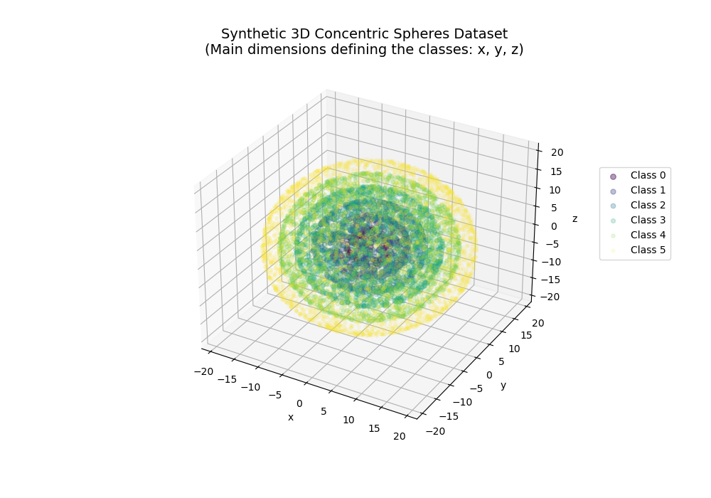
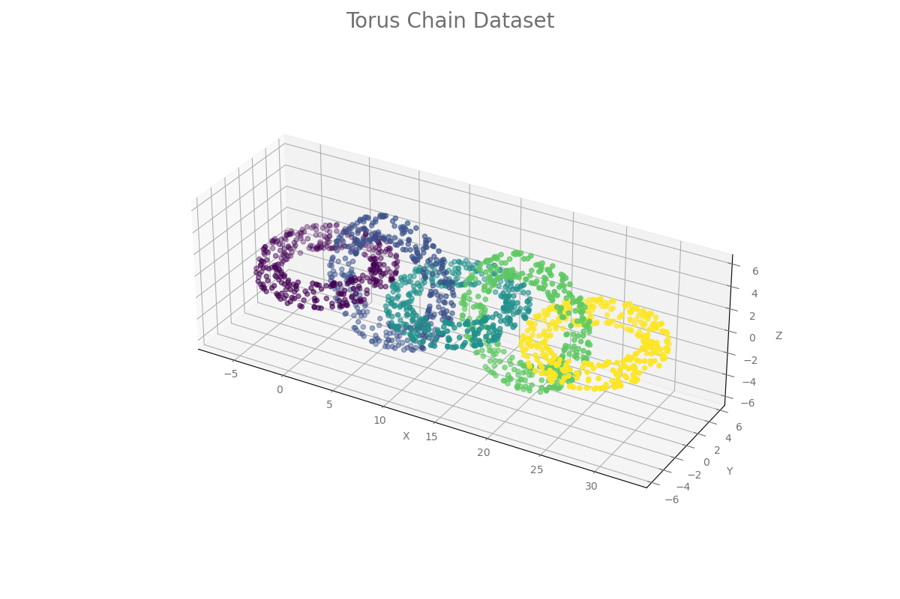

# Datasets for Multi-Class Classification category on Ready Tensor

This repository contains benchmark datasets for the **Multiclass Classification** category on Ready Tensor. There are a total of 15 benchmarking datasets used in this category. Additionally, there is a 16th dataset for smoke testing of models. The following is the list of datasets:

| Dataset                                   | Industry                      | Observations | Features | # of classes | Has Categorical | Missing Values |
| ----------------------------------------- | ----------------------------- | :----------: | :------: | :----------: | :-------------: | :------------: |
| Car Evaluation                            | Automotive                    |    1,728     |    6     |      4       |       yes       |       no       |
| Splice-Junction Gene Sequences            | Molecular Biology             |    3,178     |    60    |      3       |       yes       |       no       |
| Gesture Phase Segmentation                | Biomechanics / Biosciences    |    9,900     |    32    |      5       |       no        |       no       |
| IPUMS Census Database - Small             | Demographics / Census         |    7,485     |    61    |      7       |       yes       |      yes       |
| Iris                                      | Biosciences                   |     150      |    4     |      3       |       no        |       no       |
| Statlog (Landsat Satellite)               | Space / Geospatial Technology |    6,435     |    36    |      6       |       no        |       no       |
| Modulus-8                                 | None (synthetic)              |    8,000     |    5     |      8       |       no        |       no       |
| Nursery                                   | Education                     |    12,960    |    8     |      5       |       yes       |       no       |
| Optical Recognition of Handwritten Digits | Technology / Computer Vision  |    5,620     |    64    |      10      |       no        |       no       |
| Six Concentric Spheres                    | None (synthetic)              |    14,265    |    73    |      6       |       no        |      yes       |
| Smoke Test Dataset - MC                   | None (synthetic)              |     200      |    2     |      3       |       yes       |      yes       |
| Soybean (Large)                           | Plant Pathology               |     683      |    35    |      19      |       yes       |      yes       |
| Steel Plates Faults                       | Steel Manufacturing           |    1,941     |    26    |      7       |       yes       |       no       |
| Student Dropout Prediction                | Education                     |    4,424     |    36    |      3       |       yes       |       no       |
| Torus Chain                               | None (synthetic)              |    2,500     |    3     |      5       |       no        |      yes       |
| Vehicle Silhouettes                       | Automotive                    |     846      |    18    |      4       |       no        |       no       |

More information about each dataset is provided in the sections below.

---

## Project Contents

In this repository, you will find the following:

- `datasets` folder contains the datasets used in benchmarking for the Multi-Class Classification category on Ready Tensor.

  - `processed` folder contains the processed files. These files are used in algorithm evaluations.

    - The CSV file with suffix "\_train.csv" is used for training
    - "\_test.csv" is used for testing (without the targets)
    - "\_test_key.csv" contains the ids and targets for the test data. This test key file is used to generate scores by comparing with predictions.
    - The JSON file with suffix "\_schema.json" is the schema file for the corresponding dataset.
    - The json file with the suffix "\_inference_request_sample.json" contains a sample JSON object with the data to make an inference request to the /infer endpoint.
    - The CSV file with the dataset name, and no other suffix, is the full data (made of both train and test sets).

  - The `raw` folder contains the original data files from the source (see attributions below). The Jupyter notebook file within each dataset folder is used to convert the raw data file for each dataset in `raw` folder into the processed CSV form in `processed` folder.

- The folder `config` contains two csv files - one called `multiclass_classification_datasets_metadata.csv` which contains the dataset level attribute information. The second csv called `multiclass_classification_datasets_fields.csv` contains information regarding all the fields in each of the datasets. These two files are used by the following scripts to generate the schema, train, test, test_key, and sample inference request data files for each dataset.
- `generate_schemas.py`: contains the code to generate the schema files for each dataset.
- `create_train_test_key_files.py`: contains the code to generate the train, test, and test-key files for each dataset.
- `generate_inference_data.py`: contains the code to generate the inference request sample data for each dataset.
- `run_all.py`: This is used to run the above three scripts in sequence.

Note again that the main files for all the datasets are in the `processed` folder.

The following sections provide more information for each of the datasets.

---

## Datasets

The following is the list of datasets along with a brief description for each and its attribution:

---

### Car Evaluation

#### Alias (in scorecards): car_evaluation

#### Domain / Industry: Automotive

#### Description

Car Evaluation dataset - categorize cars into unacceptable, acceptable, good and very-good categories based on car attributes, all of which are categorical.

#### Dataset characteristics

- Number of samples = 1,728
- Number of input features = 6
- Number of target classes = 4
- Has categorical features = Yes
- Has missing values = No

#### Attribution

Creators:  
Marko Bohanec

Donors:  
Marko Bohanec (marko.bohanec@ijs.si)  
Blaz Zupan (blaz.zupan@ijs.si)

Car Evaluation Database was derived from a simple hierarchical decision model originally developed for the demonstration of DEX, M. Bohanec, V. Rajkovic: Expert system for decision making. Sistemica 1(1), pp. 145-157, 1990.

Dataset can be found here:  
https://archive.ics.uci.edu/dataset/19/car+evaluation

UCI Machine Learning Repository  
http://archive.ics.uci.edu/ml  
Irvine, CA: University of California, School of Information and Computer Science.

---

### DNA Splice-Junction Gene Sequences

#### Alias (in scorecards): dna_splice_junction

#### Domain / Industry: Molecular Biology

#### Description

The problem posed in this dataset is to recognize, given a sequence of DNA, the boundaries between exons (the parts of the DNA sequence retained after splicing) and introns (the parts of the DNA sequence that are spliced out). This problem consists of two subtasks: recognizing exon/intron boundaries (referred to as EI sites), and recognizing intron/exon boundaries (IE sites). In the biological community, IE borders are referred to as acceptors while EI borders are referred to as donors.

#### Dataset characteristics

- Number of samples = 3,178
- Number of input features = 60
- Number of target classes = 3
- Has categorical features = Yes
- Has missing values = No

Original dataset contains 3,190 samples. The field called `Instance` is used as the unique identifier. Some instance ids had multiple records - in such case, the first record is retained and others are dropped.

#### Attribution

Creators:  
All examples taken from Genbank 64.1
Categories "ei" and "ie" include every "split-gene" for primates in Genbank 64.1
non-splice examples taken from sequences known not to include a splicing site

Donor:  
G. Towell, M. Noordewier, and J. Shavlik
{towell,shavlik}@cs.wisc.edu, noordewi '@' cs.rutgers.edu}

Dataset can be found here:  
http://archive.ics.uci.edu/ml/datasets/Molecular+Biology+(Splice-junction+Gene+Sequences)

UCI Machine Learning Repository  
http://archive.ics.uci.edu/ml  
Irvine, CA: University of California, School of Information and Computer Science.

---

## Gesture Phase Segmentation

#### Alias (in scorecards): gesture_phase

#### Domain / Industry: Biomechanics / Biosciences

#### Description

Dataset consists of features extracted from 7 videos with people gesticulating, aiming at studying Gesture Phase Segmentation. Features define the velocity and acceleration of hands and wrists. The gestures are classified into one of 5 categories: D (rest position, from portuguese “descanso”), P (preparation), S (stroke), H (hold), R (retraction).

#### Dataset characteristics

- Number of samples = 9,900
- Number of input features = 32
- Number of target classes = 5
- Has categorical features = No
- Has missing values = No

#### Attribution

Original source of data (multiple papers):

Madeo, R. C. B. ; Lima, C. A. M. ; PERES, S. M. . Gesture Unit Segmentation using Support Vector Machines: Segmenting Gestures from Rest Positions. In: Symposium on Applied Computing (SAC), 2013, Coimbra. Proceedings of the 28th Annual
ACM Symposium on Applied Computing (SAC), 2013. p. 46-52.

Wagner, P. K. ; PERES, S. M. ; Madeo, R. C. B. ; Lima, C. A. M. ; Freitas, F. A. . Gesture Unit Segmentation Using Spatial-Temporal Information and Machine Learning. In: 27th Florida Artificial Intelligence Research Society Conference (FLAIRS), 2014, Pensacola Beach. Proceedings of the 27th Florida Artificial Intelligence Research Society Conference (FLAIRS). Palo Alto : The AAAI Press, 2014. p. 101-106.

Creators:  
Renata Cristina Barros Madeo (Madeo, R. C. B.) Priscilla Koch Wagner (Wagner, P. K.) Sarajane Marques Peres (Peres, S. M.) {renata.si, priscilla.wagner, sarajane} at -A Home 04-06-2020 Dr. Sarajane M. Peres

Dataset can be found here:  
https://archive.ics.uci.edu/ml/datasets/gesture+phase+segmentation#

UCI Machine Learning Repository  
http://archive.ics.uci.edu/ml  
Irvine, CA: University of California, School of Information and Computer Science.

---

### IPUMS Census Small

#### Alias (in scorecards): ipums_census_small

#### Domain / Industry: Demographics / Census

#### Description

The original source for this data set is the IPUMS project (RugglesSobek, 1997). The IPUMS project is a large collection of federal census data which has standardized coding schemes to make comparisons across time easy.

The dataset consists of samples of households or dwellings from the Los Angeles - Long Beach area. We use the smaller version of the dataset which contains a 1 in 1000 sample from the given area. It was formed by sampling from the larger dataset (1 in 100 samples).

The task is to predict the ‘movedin’ category, given various demographic attributes regarding households.

#### Dataset characteristics

- Number of samples = 7,485
- Number of input features = 61
- Number of target classes = 7
- Has categorical features = Yes
- Has missing values = Yes

#### Attribution

Source:  
Steven Ruggles and Matthew Sobek et. al.
Integrated Public Use Microdata Series: Version 2.0
Minneapolis: Historical Census Projects,
University of Minnesota, 1997

Relevant paper:  
S. Ruggles. (1995). "Sample Designs and Sampling Errors". Historical Methods. Volume 28. Number 1. Pages 40 - 46.

Dataset can be found here:  
https://archive.ics.uci.edu/ml/datasets/IPUMS+Census+Database

UCI Machine Learning Repository  
http://archive.ics.uci.edu/ml  
Irvine, CA: University of California, School of Information and Computer Science.

---

## Iris

#### Alias (in scorecards): iris

#### Domain / Industry: Biosciences

#### Description

This is the popular iris dataset used in academic courses related to multiclass classification, clustering and pattern recognotion.

The data set contains 3 classes of 50 instances each, where each class refers to a type of iris plant. One class is linearly separable from the other 2; the latter are NOT linearly separable from each other.

#### Dataset characteristics

- Number of samples = 150
- Number of input features = 4
- Number of target classes = 3
- Has categorical features = No
- Has missing values = No

#### Attribution

Source:  
Fisher,R.A. "The use of multiple measurements in taxonomic problems" Annual Eugenics, 7, Part II, 179-188 (1936); also in "Contributions to Mathematical Statistics" (John Wiley, NY, 1950).

Creator:  
R.A. Fisher

Donor:  
Michael Marshall (MARSHALL%PLU '@' io.arc.nasa.gov)

Dataset can be found here: https://archive.ics.uci.edu/ml/datasets/iris

UCI Machine Learning Repository  
http://archive.ics.uci.edu/ml  
Irvine, CA: University of California, School of Information and Computer Science.

---

### Landsat Satellite

#### Alias (in scorecards): landsat_satellite

#### Domain / Industry: Space / Geospatial Technology

#### Description

The database consists of the multi-spectral values of pixels in 3x3 neighbourhoods in a satellite image, and the classification associated with the central pixel in each neighbourhood. The aim is to predict this classification, given the multi-spectral values. In the sample database, the class of a pixel is coded as a number.

#### Dataset characteristics

- Number of samples = 6,435
- Number of input features = 36
- Number of target classes = 6
- Has categorical features = No
- Has missing values = No

#### Attribution

Source:  
Ashwin Srinivasan  
Department of Statistics and Data Modeling  
University of Strathclyde  
Glasgow  
Scotland  
UK  
ross '@' uk.ac.turing

The original Landsat data for this database was generated from data purchased from NASA by the Australian Centre for Remote Sensing, and used for research at:  
The Centre for Remote Sensing  
University of New South Wales  
Kensington, PO Box 1  
NSW 2033  
Australia

Dataset can be found here:  
http://archive.ics.uci.edu/ml/datasets/Statlog+(Landsat+Satellite)

UCI Machine Learning Repository  
http://archive.ics.uci.edu/ml  
Irvine, CA: University of California, School of Information and Computer Science.

---

### Modulus-8

#### Alias (in scorecards): modulus8

#### Domain / Industry: N/A (Synthetic)

#### Description

This is a synthetically generated dataset tailored to challenge multi-class classification models in high-dimensional feature spaces.

The dataset features five independent predictors, each with random integer values ranging from 0 to 100. The target class is computed by summing the values of these five features and then applying a modulus operation of 8. The result of this operation, ranging from 0 to 7, determines the class label. By design, the final dataset has an uneven distribution across the eight target classes:

- 100 samples for class 0
- 200 for class 1
- 300 for class 2
- 500 for class 3
- 800 for class 4
- 1,200 for class 5
- 2,000 for class 6, and
- 3,000 for class 7

Each entry in the dataset has an ID, the five predictors, and the target class.

The dataset's construction presents a substantial classification challenge. The cyclic nature induced by the modulus operation, the potential for overlapping sums, the broad value range due to the summation of five uniformly sampled features, and the imbalanced class distribution collectively make discerning class boundaries a complex task. The "Modulus-8" dataset is not just a routine test but a stringent trial, designed to be harder than many real-world tasks.

#### Dataset characteristics

- Number of samples = 8,000
- Number of input features = 5
- Number of target classes = 8
- Has categorical features = No
- Has missing values = No

#### Attribution

Dataset was synthetically generated by [Ready Tensor](https://www.readytensor.ai/) team.

---

### Nursery

#### Alias (in scorecards): nursery

#### Domain / Industry: Education

#### Description

Nursery Database was derived from a hierarchical decision model originally developed to rank applications for nursery schools. It was used during several years in 1980's when there was excessive enrollment to these schools in Ljubljana, Slovenia, and the rejected applications frequently needed an objective explanation. The final decision depended on three subproblems:

- occupation of parents and child's nursery
- family structure and
- financial standing, and social and health picture of the family.

This dataset can be used for multiclass classification to predict the decision of nursery school admission. The decision falls into one of five categories: not_recom, recommend, very_recom, priority, spec_prior.

#### Dataset characteristics

- Number of samples = 12,960
- Number of input features = 8
- Number of target classes = 5
- Has categorical features = Yes
- Has missing values = No

#### Attribution

Creator:
Vladislav Rajkovic et al. (13 experts)

Donor:  
Marko Bohanec (marko.bohanec@ijs.si)  
Blaz Zupan (blaz.zupan@ijs.si)

Dataset can be found here:
https://archive.ics.uci.edu/dataset/76/nursery

UCI Machine Learning Repository  
http://archive.ics.uci.edu/ml  
Irvine, CA: University of California, School of Information and Computer Science.

---

### Optical Digit Recognition

#### Alias (in scorecards): optical_digit_recognition

#### Domain / Industry: Technology / Computer Vision

#### Description

This dataset contains features related to extracted normalized bitmaps of handwritten digits from a preprinted form. The original scanned digits are binary images of size 32x32. The images are divided into non-overlapping blocks of 4x4 and the number of on pixels are counted in each block. This generates an input matrix of 8x8 where each element is an integer in the range 0..16. This reduces dimensionality and gives invariance to small distortions. This dataset can be used for tabular multiclass classification problem. The task is to predict the digit (0-9) given the 64 features (corresponding to the 8x8 matrix).

Note that the original dataset contained separate files for training and testing. These are concatenated into a single file for this benchmark, and then a random 80-20 split is used to create the train and test sets.

#### Dataset characteristics

- Number of samples = 5,620
- Number of input features = 64
- Number of target classes = 10
- Has categorical features = No
- Has missing values = No

#### Attribution

Source / Donors:  
E. Alpaydin, C. Kaynak  
Department of Computer Engineering  
Bogazici University, 80815 Istanbul Turkey  
alpaydin@boun.edu.tr

Dataset can be found here:  
https://archive.ics.uci.edu/dataset/80/optical+recognition+of+handwritten+digits

UCI Machine Learning Repository  
http://archive.ics.uci.edu/ml  
Irvine, CA: University of California, School of Information and Computer Science.

---

### Six Concentric Spheres

#### Alias (in scorecards): six_concentric_spheres

#### Domain / Industry: N/A (Synthetic)

#### Description

This is a synthetically dataset consisting of a series of 3D spheres nested within each other. Each sphere forms a distinct class, presenting a multi-class classification problem in a 3-dimensional space. Dataset also contains three features that are correlated with the featues representing the original coordinates `x`, `y`, and `z` individually. Additionally, there are 67 features that are random noise. All features have a small percentage of missing values. The task is to predict the class (sphere) of each sample.

See plot of generated data (original 3 coordinates):

  

#### Dataset characteristics

- Number of samples = 14,265
- Number of input features = 73
- Number of target classes = 6
- Has categorical features = Yes
- Has missing values = Yes

#### Attribution

Dataset was synthetically generated by [Ready Tensor](https://www.readytensor.ai/) team.

---

## Smoke Test Dataset - MC

#### Alias (in scorecards): smoke_test_mc

#### Domain / Industry: N/A (Synthetic)

#### Description

This synthetic dataset presents a multiclass classification problem based on two types of features and a target with three classes. Each sample in the dataset has a unique identifier, a set of two features (color, number), and a target class label.

#### Dataset characteristics

- Number of samples = 200
- Number of input features = 2
- Number of target classes = 3
- Has categorical features = Yes
- Has missing values = Yes

#### Attribution

Dataset was synthetically generated by [Ready Tensor](https://www.readytensor.ai/) team.

---

## Soybean Disease

#### Alias (in scorecards): soybean_disease

#### Domain / Industry: Plant Pathology

#### Description

This is the soybean disease diagnosis dataset. Samples contain 35 attributes from soybean that can be used to classify each sample into one of 19 disease types. The features are all categorical, some nominal and some ordered.

#### Dataset characteristics

- Number of samples = 683
- Number of input features = 35
- Number of target classes = 19
- Has categorical features = Yes
- Has missing values = Yes

Note that the original data has separate files for training and testing. These are concatenated into a single file for this benchmark, and then a random 80-20 split is used to create the train and test sets.

#### Attribution

Dataset from this study:

R.S. Michalski and R.L. Chilausky "Learning by Being Told and Learning from Examples: An Experimental Comparison of the Two Methods of Knowledge Acquisition in the Context of Developing an Expert System for Soybean Disease Diagnosis", International Journal of Policy Analysis and Information Systems, Vol. 4, No. 2, 1980.

Donor:  
Ming Tan & Jeff Schlimmer (Jeff.Schlimmer%cs.cmu.edu)

Dataset can be found here:  
https://archive.ics.uci.edu/ml/datasets/Soybean+(Large)

UCI Machine Learning Repository  
http://archive.ics.uci.edu/ml  
Irvine, CA: University of California, School of Information and Computer Science.

---

## Steel Plate Faults

#### Alias (in scorecards): steel_plate_faults

#### Domain / Industry: Steel Manufacturing

#### Description

A dataset of steel plates faults, classified into 7 different types. The input features are 27 indicators that approximately describe the geometric shape of the defect and its outline.

#### Dataset characteristics

- Number of samples = 1,941
- Number of input features = 26
- Number of target classes = 7
- Has categorical features = Yes
- Has missing values = No

#### Attribution

Source:

Semeion, Research Center of Sciences of Communication, Via Sersale 117, 00128, Rome, Italy.
www.semeion.it

Dataset can be found here:  
https://archive.ics.uci.edu/dataset/198/steel+plates+faults

UCI Machine Learning Repository  
http://archive.ics.uci.edu/ml  
Irvine, CA: University of California, School of Information and Computer Science.

---

## Student Dropout

#### Alias (in scorecards): student_dropout

#### Domain / Industry: Education

#### Description

This is a dataset related to students enrolled in different undergraduate degrees. The data is used to build classification models to predict students' dropout and academic sucess. The problem is formulated as a three category classification task, in which there is a strong imbalance towards one of the classes.

#### Dataset characteristics

- Number of samples = 4,424
- Number of input features = 36
- Number of target classes = 3
- Has categorical features = Yes
- Has missing values = No

#### Attribution

Creators:

Valentim Realinho  
vrealinho@  
Instituto Politécnico de Portalegre

Mónica Vieira Martins  
mvmartins@ipportalegre.pt  
Instituto Politécnico de Portalegre

Jorge Machado  
jmachado@ipportalegre.pt
Instituto Politécnico de Portalegre

Luís Baptista  
lmtb@ipportalegre.pt  
Instituto Politécnico de Portalegre

Dataset can be found here:  
https://archive.ics.uci.edu/dataset/697/predict+students+dropout+and+academic+success

UCI Machine Learning Repository  
http://archive.ics.uci.edu/ml  
Irvine, CA: University of California, School of Information and Computer Science.

---

## Torus Chain

#### Alias (in scorecards): torus_chain

#### Domain / Industry: N/A (Synthetic)

#### Description

A synthetic dataset consisting of a chain of 5 torus rings in a 3D space. The chain represents a multi-class classification problem in a 3-dimensional space, with each torus ring forming a separate class.

The following plot shows the data:

  

#### Dataset characteristics

- Number of samples = 2,500
- Number of input features = 3
- Number of target classes = 5
- Has categorical features = No
- Has missing values = Yes

#### Attribution

Dataset was synthetically generated by [Ready Tensor](https://www.readytensor.ai/) team.

---

### Vehicle Silhouettes

#### Alias (in scorecards): vehicle_silhouettes

#### Domain / Industry: Automotive

#### Description

The purpose is to classify a given silhouette as one of four types of vehicle, using a set of features extracted from the silhouette. The vehicle may be viewed from one of many different angles.

Four "Corgie" model vehicles were used for the experiment: a double decker bus, Cheverolet van, Saab 9000 and an Opel Manta 400. This particular combination of vehicles was chosen with the expectation that the bus, van and either one of the cars would be readily distinguishable, but it would be more difficult to distinguish between the cars.

The features were extracted from the silhouettes by the HIPS (Hierarchical Image Processing System) extension BINATTS, which extracts a combination of scale independent features utilising both classical moments based measures such as scaled variance, skewness and kurtosis about the major/minor axes and heuristic measures such as hollows, circularity, rectangularity and compactness.

The original purpose of the study was to find a method of distinguishing 3D objects within a 2D image by application of an ensemble of shape feature extractors to the 2D silhouettes of the objects. Measures of shape features extracted from example silhouettes of objects to be discriminated were used to generate a classification rule tree by means of computer induction.

#### Dataset characteristics

- Number of samples = 846
- Number of input features = 18
- Number of target classes = 4
- Has categorical features = No
- Has missing values = No

#### Attribution

Data comes from this study:  
Siebert,JP. Turing Institute Research Memorandum TIRM-87-018 "Vehicle Recognition Using Rule Based Methods" (March 1987).

Source:  
Drs.Pete Mowforth and Barry Shepherd
Turing Institute
George House
36 North Hanover St.
Glasgow
G1 2AD

Dataset can be found here:  
https://archive.ics.uci.edu/ml/datasets/Statlog+(Vehicle+Silhouettes)

UCI Machine Learning Repository  
http://archive.ics.uci.edu/ml  
Irvine, CA: University of California, School of Information and Computer Science.

---
